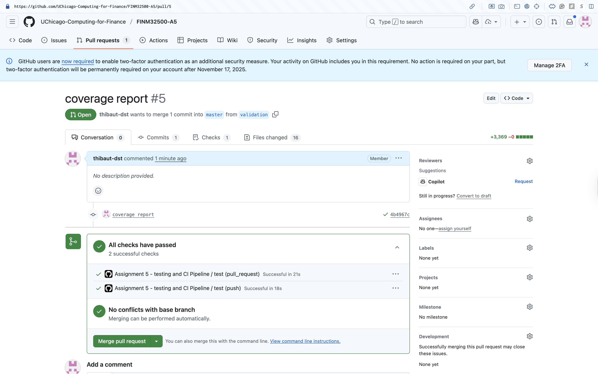
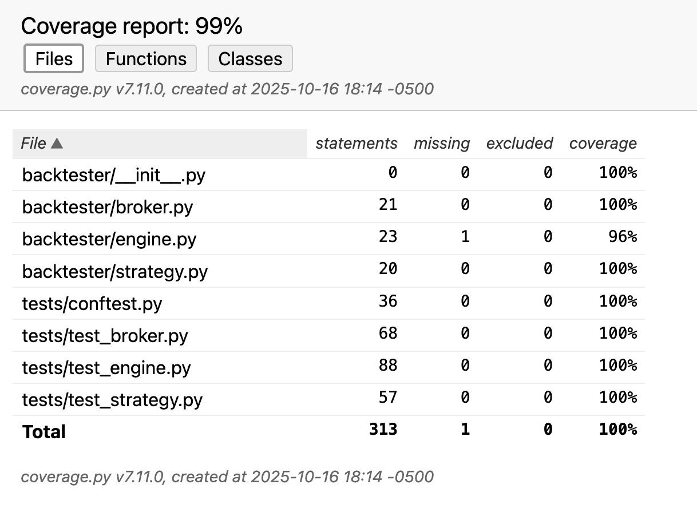

# Assigment 5: Testing & CI in Financial Engineering

## Desgin notes

- The broker class is responsible for managing the cash and position of the portfolio.
- The engine class is responsible for running the backtest and executing the trades.
- The strategy class is responsible for generating the signals.
- The price loader class is responsible for loading the price data.
- The test suite is responsible for testing the broker, engine, and strategy classes.

## Git Actions



## Coverage Report



### Test Execution Commands

**Run all tests:**
```bash
PYTHONPATH=. pytest -q
coverage report
```
